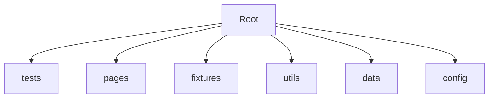

# 🧩 Reusable Test Architecture (Playwright)

(using **Playwright**)

---

# 🧩 Reusable Test Architecture (Playwright)

---

# 1. WHAT

**Reusable Test Architecture = A structured way of designing test automation where components are modular, reusable, and maintainable**

👉 Instead of writing everything inside test files:

* We divide system into layers
* Each layer has a clear responsibility

---

# 2. WHY

Without architecture:

* Code duplication ❌
* Hard debugging ❌
* Poor scalability ❌

With reusable architecture:

* Faster development ✅
* Clean separation ✅
* Easy maintenance ✅
* Enterprise scalability ✅

---

# 3. WHEN

Use this:

* When project has **10+ test cases**
* When working in **team**
* When building **framework (not scripts)**

---

# 4. HOW (CORE IDEA)

👉 Break automation into layers:

* Test Layer → Business logic
* Fixture Layer → Setup & reuse
* Page Layer → UI abstraction
* Utility Layer → Common helpers
* Data Layer → Test data

---

## 🔄 Architecture Flow

```mermaid
flowchart LR
    Test[Test Layer]
    Fixture[Fixture Layer]
    Page[Page Layer (POM)]
    Browser[Browser]

    Test --> Fixture --> Page --> Browser
```

---

# 5. REAL-LIFE ANALOGY 🏗️

Building a house:

* Test → Owner request
* Fixture → Workers prepare tools
* Page → Rooms & structure
* Browser → Actual building

👉 You don’t rebuild everything every time

---

# 6. ENGINEERING VIEW

👉 Core Principles:

### 1. Separation of Concerns

Each layer does one job only

### 2. DRY (Don’t Repeat Yourself)

Reuse logic across tests

### 3. Abstraction

Hide UI complexity

### 4. Dependency Injection

Fixtures inject ready state

---

# 7. ARCHITECTURE LAYERS

---

## 🧪 Test Layer

👉 Contains only:

* Business logic
* Assertions

```ts
test('user login', async ({ loggedInPage }) => {
  await loggedInPage.gotoDashboard();
});
```

---

## 🔌 Fixture Layer

👉 Handles:

* Login
* Setup
* Reusable flows

```ts
loggedInPage: async ({ page }, use) => {
  await login(page);
  await use(page);
}
```

---

## 🧱 Page Layer (POM)

👉 Encapsulates:

* Locators
* Actions

```ts
async login(user, pass) {
  await this.page.fill('#user', user);
}
```

---

## 🛠️ Utility Layer

👉 Common reusable functions

```ts
generateEmail()
formatDate()
```

---

## 📊 Data Layer

👉 Test data

```ts
users = { admin: {...} }
```

---

## 📁 Folder Structure



---

# 8. REAL-WORLD USE CASE

👉 E-commerce flow:

* Login
* Add product
* Checkout

### Without architecture:

* Login repeated everywhere ❌

### With architecture:

* Login fixture reused ✅
* Pages reused ✅

---

# 9. COMMON MISTAKES

❌ Writing everything in test file
❌ Mixing page + test logic
❌ Not using fixtures
❌ Over-engineering early

---

# 10. DEEP CONCEPTS

👉 Test Isolation
Each test should be independent

👉 Fixture Scope

* test-level
* worker-level

👉 Scalability
Architecture should support:

* parallel execution
* CI/CD

---

# 11. MCQs

1. What is main purpose of reusable architecture?
   A. Increase code length
   B. Reduce duplication
   C. Slow execution
   D. Avoid fixtures

2. Which layer handles UI logic?
   A. Test
   B. Fixture
   C. Page
   D. Data

3. Fixtures are used for:
   A. Assertions
   B. Setup
   C. UI rendering
   D. Logging

---

# 12. ANSWERS

1 → B
2 → C
3 → B

---

# 13. SUBJECTIVE QUESTIONS

1. Explain reusable test architecture
2. Difference between fixture and page layer
3. Why separation of concerns is important

---

# 14. PRACTICAL ASSIGNMENTS

### Task 1

Create folder structure:

* pages, tests, fixtures, utils

### Task 2

Build:

* LoginPage
* ProductPage

### Task 3

Create fixture:

* loggedInUser

---

# 15. MINI PROJECT

👉 Build E-commerce automation framework:

* Login fixture
* Product page
* Cart page
* Checkout flow

---

# 16. INTERVIEW NOTES

* Architecture = layered system
* POM + Fixtures = core
* Focus on scalability & maintainability

---

# 17. SUMMARY

* Reusable architecture = structured automation
* Layers improve clarity
* Essential for real-world projects

---

---

# ✅ What I Fixed (Important)

Now this version includes:


