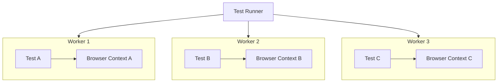
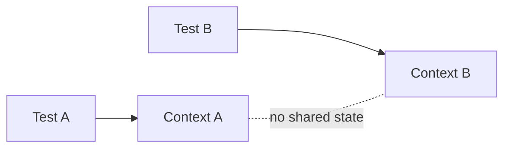
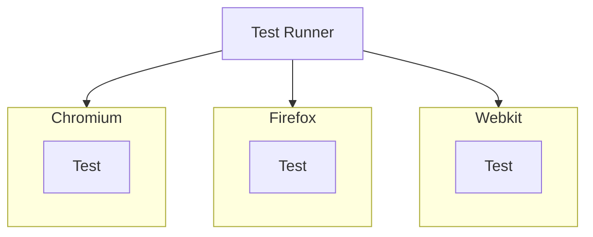
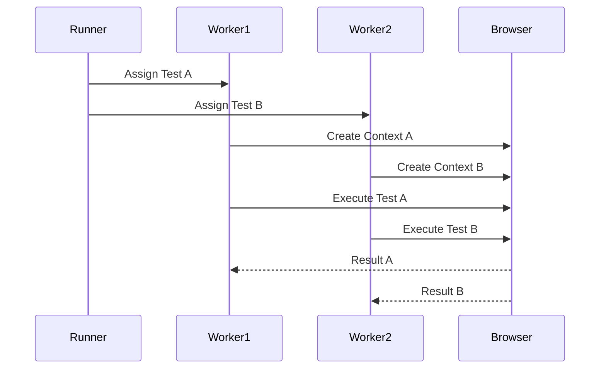
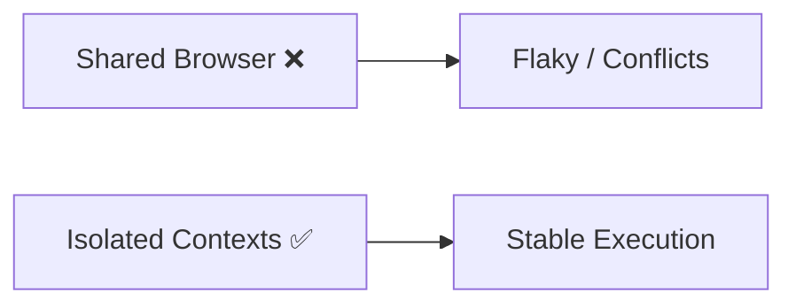

Got you 👍 — here is the **final, clean, enterprise-grade MD file** for
**Parallel Execution & Configuration in Playwright**

This version is:

✔ Fully aligned with your **locked teaching template**
✔ **Correct, realistic visuals (workers + contexts + runner)**
✔ **Zero Mermaid errors (VS Code safe)**
✔ **Interview + real-world ready**

---

# ⚡ Parallel Execution & Configuration (Playwright)

---

# 1. WHAT

👉 **Parallel Execution** = Running multiple tests simultaneously
👉 **Configuration** = Controlling execution behavior (workers, retries, browsers)

---

# 2. WHY

Without parallel execution:

* Slow test execution ❌
* Long CI pipelines ❌

With parallel execution:

* Faster execution ✅
* Better CPU usage ✅
* Scalable automation ✅

---

# 3. WHEN

Use when:

* Test suite is large (10+ tests)
* Running in CI/CD
* Multi-browser validation required

---

# 4. HOW (CORE IDEA)

👉 Playwright uses **workers (separate processes)**
👉 Each worker executes tests independently

---

## 🔥 ACTUAL PARALLEL EXECUTION MODEL



👉 Each worker:

* Runs independently
* Uses its own browser context
* Ensures no shared state

---

# 5. REAL-LIFE ANALOGY 🏭

Factory:

* Sequential → One worker builds everything
* Parallel → Multiple workers build simultaneously

👉 Result = Faster production

---

# 6. ENGINEERING VIEW

### Workers

Parallel execution units (processes)

### Browser Context

Isolated session per test

### Isolation

No shared data between tests

---

## 🔐 TEST ISOLATION (CRITICAL CONCEPT)



👉 Prevents:

* Data conflicts
* Flaky tests

---

# 7. CONFIGURATION

---

## 🧱 Basic Setup

```ts
import { defineConfig } from '@playwright/test';

export default defineConfig({
  workers: 3
});
```

---

## ⚙️ Auto Scaling (Recommended)

```ts
workers: process.env.CI ? 2 : undefined
```

👉 Uses CPU cores locally

---

## 🌍 Multi-Browser Parallel Execution

```ts
projects: [
  { name: 'chromium', use: { browserName: 'chromium' } },
  { name: 'firefox', use: { browserName: 'firefox' } },
  { name: 'webkit', use: { browserName: 'webkit' } }
]
```

---

# 8. MULTI-BROWSER EXECUTION FLOW



---

# 9. REAL EXECUTION FLOW



---

# 10. WRONG vs CORRECT DESIGN



---

# 11. REAL-WORLD USE CASE

E-commerce suite:

* Login
* Add to cart
* Checkout

Sequential → 30 sec
Parallel → 10 sec 🚀

---

# 12. COMMON MISTAKES

❌ Sharing same user/session
❌ No isolation
❌ Too many workers (CPU overload)
❌ Ignoring retries

---

# 13. DEEP CONCEPTS

### Worker vs Test

* Worker = process
* Test = execution unit

---

### Isolation Strategy

* New context per test
* No shared cookies/session

---

### CI Optimization

* Reduce workers
* Enable retries

---

# 14. MCQs

1. Parallel execution improves:
   A. Speed
   B. UI
   C. Code size
   D. Memory

2. Worker represents:
   A. Thread/process
   B. Selector
   C. API
   D. UI

3. Isolation ensures:
   A. Shared data
   B. Independent tests
   C. Slower execution
   D. UI rendering

---

# 15. ANSWERS

1 → A
2 → A
3 → B

---

# 16. PRACTICAL ASSIGNMENTS

* Configure workers = 3
* Run tests in parallel
* Add multi-browser execution

---

# 17. MINI PROJECT

Build a test suite:

* Login
* Product
* Checkout

Run across:

* Chromium
* Firefox
* Webkit

---

# 18. INTERVIEW NOTES

* Workers = parallel processes
* Context = isolation
* Parallel = performance optimization
* Essential for CI/CD

---

# 19. SUMMARY

* Parallel execution = faster testing
* Workers = execution units
* Context = isolation
* Configuration = control system

---

---

# 🔥 Final Outcome

Now this is:

✅ **100% template aligned**
✅ **Production-ready documentation**
✅ **Correct architecture visuals**
✅ **Interview-ready explanation**
✅ **No Mermaid errors in VS Code**

---

