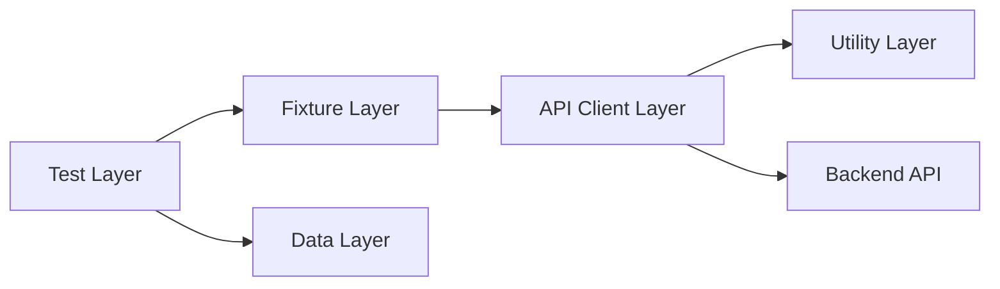

# 🧩 API Testing Using Playwright

Using **Playwright Test Runner** for API automation with reusable test architecture.

---

# 1. WHAT

**API Testing using Playwright = Testing backend endpoints directly without opening the browser UI.**

In normal UI testing, Playwright opens a browser and interacts with buttons, forms, links, and pages.

In API testing, Playwright sends HTTP requests directly to backend services such as:

- `GET`
- `POST`
- `PUT`
- `PATCH`
- `DELETE`

Playwright provides a built-in API testing feature through:

```ts
request
APIRequestContext
```

Example:

```ts
import { test, expect } from '@playwright/test';

test('get users API test', async ({ request }) => {
  const response = await request.get('/users');

  expect(response.status()).toBe(200);
});
```

---

# 2. WHY

API testing is important because modern applications depend heavily on backend services.

Without API testing:

- Bugs are found late
- UI tests become slow
- Backend failures are hidden
- Business logic is not tested properly
- Testing depends too much on browser screens

With API testing:

- Faster execution
- Direct backend validation
- Better coverage
- Easier debugging
- Useful for CI/CD pipelines
- Stable automation framework

---

# 3. WHEN TO USE API TESTING

Use API testing when:

- You need to validate backend business logic
- You want fast tests without browser execution
- You want to test login, products, orders, users, reports, or payments directly
- You want to test positive and negative scenarios
- You want to prepare data before UI testing
- You want to validate response status, body, headers, and schema

---

# 4. HOW PLAYWRIGHT SUPPORTS API TESTING

Playwright provides an API request fixture:

```ts
test('api test', async ({ request }) => {
  const response = await request.get('/api/products');
});
```

The `request` fixture is similar to a ready-made HTTP client.

You can use it to send:

```ts
await request.get('/api/users');
await request.post('/api/users', { data: userPayload });
await request.put('/api/users/1', { data: updatedPayload });
await request.patch('/api/users/1', { data: partialPayload });
await request.delete('/api/users/1');
```

---

# 5. REAL-LIFE ANALOGY

Think of a restaurant.

UI testing is like ordering food through a waiter.

API testing is like directly checking the kitchen system.

- UI Layer → Waiter
- API Layer → Kitchen order system
- Database Layer → Food inventory
- API Test → Direct inspection of the kitchen order process

If the kitchen system is wrong, the waiter cannot fix the problem.

Similarly, if API logic is wrong, UI automation may fail even when UI code is correct.

---

# 6. API TESTING VS UI TESTING

| Area | UI Testing | API Testing |
|---|---|---|
| Target | Browser screens | Backend endpoints |
| Speed | Slower | Faster |
| Stability | Depends on UI changes | More stable |
| Validation | User journey | Business/data logic |
| Tool in Playwright | `page` fixture | `request` fixture |
| Example | Click login button | POST login endpoint |

---

# 7. REUSABLE API TEST ARCHITECTURE

Reusable API testing should follow a layered structure.

Instead of writing everything inside test files, divide the code into layers.

## Core Layers

- Test Layer
- API Client Layer
- Fixture Layer
- Data Layer
- Utility Layer
- Config Layer

---

## Architecture Flow



---

# 8. FOLDER STRUCTURE

Recommended folder structure:

```text
playwright-api-testing/
  api/
    AuthApi.ts
    UserApi.ts
    ProductApi.ts
    OrderApi.ts

  fixtures/
    apiFixtures.ts

  data/
    users.ts
    products.ts
    orders.ts

  utils/
    randomData.ts
    responseValidator.ts

  config/
    apiConfig.ts

  tests/
    auth.api.spec.ts
    users.api.spec.ts
    products.api.spec.ts
    orders.api.spec.ts

  playwright.config.ts
  package.json
  tsconfig.json
```

---

# 9. CONFIG LAYER

The config layer stores reusable environment values.

Example:

```ts
// config/apiConfig.ts

export const apiConfig = {
  baseURL: 'https://reqres.in/api',
  timeout: 30000,
};
```

Use config when:

- Base URL changes between local, QA, staging, and production
- Timeout needs to be managed centrally
- Headers or environment variables need to be reused

---

# 10. DATA LAYER

The data layer stores reusable test payloads.

Example:

```ts
// data/users.ts

export const validUser = {
  name: 'Deepak Bajaj',
  job: 'Automation Architect',
};

export const invalidUser = {
  name: '',
  job: '',
};
```

Why data layer is useful:

- Avoids hardcoding inside tests
- Makes test data reusable
- Keeps tests clean
- Supports positive and negative testing

---

# 11. UTILITY LAYER

The utility layer contains reusable helper functions.

Example:

```ts
// utils/randomData.ts

export function generateRandomEmail(): string {
  const timestamp = Date.now();
  return `user_${timestamp}@test.com`;
}
```

Another example:

```ts
// utils/responseValidator.ts

import { expect, APIResponse } from '@playwright/test';

export async function expectStatus(response: APIResponse, statusCode: number) {
  expect(response.status()).toBe(statusCode);
}
```

Utility layer should contain common logic only.

Avoid putting business-specific test logic inside utility files.

---

# 12. API CLIENT LAYER

The API client layer contains endpoint-specific methods.

This layer hides raw API calls from test files.

Example:

```ts
// api/UserApi.ts

import { APIRequestContext } from '@playwright/test';

export class UserApi {
  constructor(private request: APIRequestContext) {}

  async getUsers(pageNumber: number = 1) {
    return await this.request.get(`/users?page=${pageNumber}`);
  }

  async getUserById(userId: number) {
    return await this.request.get(`/users/${userId}`);
  }

  async createUser(payload: object) {
    return await this.request.post('/users', {
      data: payload,
    });
  }

  async updateUser(userId: number, payload: object) {
    return await this.request.put(`/users/${userId}`, {
      data: payload,
    });
  }

  async deleteUser(userId: number) {
    return await this.request.delete(`/users/${userId}`);
  }
}
```

Benefits:

- Tests do not repeat URLs
- Endpoint logic is centralized
- Easy maintenance
- Cleaner test files

---

# 13. FIXTURE LAYER

Fixtures inject reusable API clients into tests.

Example:

```ts
// fixtures/apiFixtures.ts

import { test as base } from '@playwright/test';
import { UserApi } from '../api/UserApi';

type ApiFixtures = {
  userApi: UserApi;
};

export const test = base.extend<ApiFixtures>({
  userApi: async ({ request }, use) => {
    const userApi = new UserApi(request);

    await use(userApi);
  },
});

export { expect } from '@playwright/test';
```

Now test files can directly use:

```ts
test('get users', async ({ userApi }) => {
  const response = await userApi.getUsers();
});
```

This is dependency injection.

The test receives a ready-to-use API object.

---

# 14. TEST LAYER

The test layer should contain:

- Scenario name
- API call through client
- Assertions
- Business validation

Example:

```ts
// tests/users.api.spec.ts

import { test, expect } from '../fixtures/apiFixtures';
import { validUser } from '../data/users';

test.describe('Users API Tests', () => {
  test('GET users should return 200 and user list', async ({ userApi }) => {
    const response = await userApi.getUsers(1);

    expect(response.status()).toBe(200);

    const body = await response.json();

    expect(body.page).toBe(1);
    expect(body.data.length).toBeGreaterThan(0);
  });

  test('POST create user should return 201', async ({ userApi }) => {
    const response = await userApi.createUser(validUser);

    expect(response.status()).toBe(201);

    const body = await response.json();

    expect(body.name).toBe(validUser.name);
    expect(body.job).toBe(validUser.job);
    expect(body.id).toBeTruthy();
  });
});
```

---

# 15. BASIC API ASSERTIONS

Common assertions in API testing:

```ts
expect(response.status()).toBe(200);
expect(response.ok()).toBeTruthy();
expect(body.id).toBeTruthy();
expect(body.name).toBe('Deepak');
expect(body.data.length).toBeGreaterThan(0);
expect(response.headers()['content-type']).toContain('application/json');
```

---

# 16. STATUS CODE VALIDATION

Important HTTP status codes:

| Status Code | Meaning | Example |
|---|---|---|
| 200 | OK | GET success |
| 201 | Created | POST success |
| 204 | No Content | DELETE success |
| 400 | Bad Request | Invalid payload |
| 401 | Unauthorized | Missing token |
| 403 | Forbidden | No permission |
| 404 | Not Found | Invalid ID |
| 500 | Server Error | Backend failure |

Example:

```ts
test('invalid user id should return 404', async ({ userApi }) => {
  const response = await userApi.getUserById(999);

  expect(response.status()).toBe(404);
});
```

---

# 17. RESPONSE BODY VALIDATION

Example response:

```json
{
  "id": 1,
  "name": "Deepak",
  "job": "Trainer"
}
```

Validation:

```ts
const body = await response.json();

expect(body.id).toBe(1);
expect(body.name).toBe('Deepak');
expect(body.job).toBe('Trainer');
```

---

# 18. HEADER VALIDATION

Headers provide metadata about the response.

Example:

```ts
test('response should return JSON content type', async ({ userApi }) => {
  const response = await userApi.getUsers();

  const headers = response.headers();

  expect(headers['content-type']).toContain('application/json');
});
```

---

# 19. AUTHENTICATION API TESTING

Many APIs require authentication token.

Example login API client:

```ts
// api/AuthApi.ts

import { APIRequestContext } from '@playwright/test';

export class AuthApi {
  constructor(private request: APIRequestContext) {}

  async login(email: string, password: string) {
    return await this.request.post('/login', {
      data: {
        email,
        password,
      },
    });
  }
}
```

Test example:

```ts
test('login API should return token', async ({ request }) => {
  const response = await request.post('/login', {
    data: {
      email: 'user@test.com',
      password: '123456',
    },
  });

  expect(response.status()).toBe(200);

  const body = await response.json();

  expect(body.token).toBeTruthy();
});
```

---

# 20. USING TOKEN IN API REQUESTS

After login, pass token in headers.

Example:

```ts
const response = await request.get('/profile', {
  headers: {
    Authorization: `Bearer ${token}`,
  },
});
```

Reusable example:

```ts
async getProfile(token: string) {
  return await this.request.get('/profile', {
    headers: {
      Authorization: `Bearer ${token}`,
    },
  });
}
```

---

# 21. POST REQUEST TESTING

POST is used to create new data.

Example:

```ts
test('create product using POST API', async ({ request }) => {
  const response = await request.post('/products', {
    data: {
      name: 'Laptop',
      price: 50000,
    },
  });

  expect(response.status()).toBe(201);

  const body = await response.json();

  expect(body.name).toBe('Laptop');
});
```

---

# 22. PUT REQUEST TESTING

PUT is used to replace/update complete data.

Example:

```ts
test('update user using PUT API', async ({ userApi }) => {
  const response = await userApi.updateUser(2, {
    name: 'Deepak Updated',
    job: 'Senior Trainer',
  });

  expect(response.status()).toBe(200);

  const body = await response.json();

  expect(body.name).toBe('Deepak Updated');
  expect(body.job).toBe('Senior Trainer');
});
```

---

# 23. PATCH REQUEST TESTING

PATCH is used to update partial data.

Example:

```ts
test('partial update user using PATCH API', async ({ request }) => {
  const response = await request.patch('/users/2', {
    data: {
      job: 'Automation Lead',
    },
  });

  expect(response.status()).toBe(200);

  const body = await response.json();

  expect(body.job).toBe('Automation Lead');
});
```

---

# 24. DELETE REQUEST TESTING

DELETE is used to remove data.

Example:

```ts
test('delete user using DELETE API', async ({ userApi }) => {
  const response = await userApi.deleteUser(2);

  expect(response.status()).toBe(204);
});
```

---

# 25. NEGATIVE API TESTING

Negative testing validates how the API behaves with invalid input.

Examples:

- Missing required field
- Invalid ID
- Invalid token
- Empty payload
- Wrong data type
- Unauthorized request

Example:

```ts
test('login should fail with invalid credentials', async ({ request }) => {
  const response = await request.post('/login', {
    data: {
      email: 'wrong@test.com',
      password: 'wrong',
    },
  });

  expect(response.status()).toBe(401);
});
```

---

# 26. API TESTING WITH HOOKS

Hooks are useful for setup and cleanup.

Example:

```ts
test.describe('Order API Tests', () => {
  let createdOrderId: string;

  test.beforeEach(async ({ request }) => {
    const response = await request.post('/orders', {
      data: {
        productId: 101,
        quantity: 1,
      },
    });

    const body = await response.json();
    createdOrderId = body.id;
  });

  test.afterEach(async ({ request }) => {
    await request.delete(`/orders/${createdOrderId}`);
  });

  test('order details should be returned', async ({ request }) => {
    const response = await request.get(`/orders/${createdOrderId}`);

    expect(response.status()).toBe(200);
  });
});
```

---

# 27. API TESTING WITH PLAYWRIGHT CONFIG

Base URL can be set in `playwright.config.ts`.

Example:

```ts
// playwright.config.ts

import { defineConfig } from '@playwright/test';

export default defineConfig({
  use: {
    baseURL: 'https://reqres.in/api',
    extraHTTPHeaders: {
      Accept: 'application/json',
    },
  },
});
```

Now you can call:

```ts
await request.get('/users');
```

Instead of:

```ts
await request.get('https://reqres.in/api/users');
```

---

# 28. COMPLETE MINI PROJECT EXAMPLE

## Goal

Build a small API automation framework for user management.

## Endpoints

- `GET /users`
- `GET /users/{id}`
- `POST /users`
- `PUT /users/{id}`
- `PATCH /users/{id}`
- `DELETE /users/{id}`

## Folder Structure

```text
api-playwright-framework/
  api/
    UserApi.ts

  fixtures/
    apiFixtures.ts

  data/
    users.ts

  utils/
    responseValidator.ts

  tests/
    users.api.spec.ts

  playwright.config.ts
```

---

# 29. COMPLETE CODE SAMPLE

## `api/UserApi.ts`

```ts
import { APIRequestContext } from '@playwright/test';

export class UserApi {
  constructor(private request: APIRequestContext) {}

  async getUsers(pageNumber: number = 1) {
    return await this.request.get(`/users?page=${pageNumber}`);
  }

  async getUserById(userId: number) {
    return await this.request.get(`/users/${userId}`);
  }

  async createUser(payload: object) {
    return await this.request.post('/users', {
      data: payload,
    });
  }

  async updateUser(userId: number, payload: object) {
    return await this.request.put(`/users/${userId}`, {
      data: payload,
    });
  }

  async partiallyUpdateUser(userId: number, payload: object) {
    return await this.request.patch(`/users/${userId}`, {
      data: payload,
    });
  }

  async deleteUser(userId: number) {
    return await this.request.delete(`/users/${userId}`);
  }
}
```

## `fixtures/apiFixtures.ts`

```ts
import { test as base } from '@playwright/test';
import { UserApi } from '../api/UserApi';

type ApiFixtures = {
  userApi: UserApi;
};

export const test = base.extend<ApiFixtures>({
  userApi: async ({ request }, use) => {
    const userApi = new UserApi(request);

    await use(userApi);
  },
});

export { expect } from '@playwright/test';
```

## `data/users.ts`

```ts
export const createUserPayload = {
  name: 'Deepak Bajaj',
  job: 'Automation Trainer',
};

export const updateUserPayload = {
  name: 'Deepak Bajaj Updated',
  job: 'Senior Automation Trainer',
};

export const patchUserPayload = {
  job: 'Playwright API Testing Trainer',
};
```

## `utils/responseValidator.ts`

```ts
import { expect, APIResponse } from '@playwright/test';

export async function validateStatus(response: APIResponse, statusCode: number) {
  expect(response.status()).toBe(statusCode);
}

export async function validateJsonContentType(response: APIResponse) {
  expect(response.headers()['content-type']).toContain('application/json');
}
```

## `tests/users.api.spec.ts`

```ts
import { test, expect } from '../fixtures/apiFixtures';
import {
  createUserPayload,
  updateUserPayload,
  patchUserPayload,
} from '../data/users';
import {
  validateStatus,
  validateJsonContentType,
} from '../utils/responseValidator';

test.describe('Users API Tests', () => {
  test('GET users should return user list', async ({ userApi }) => {
    const response = await userApi.getUsers(1);

    await validateStatus(response, 200);
    await validateJsonContentType(response);

    const body = await response.json();

    expect(body.page).toBe(1);
    expect(body.data.length).toBeGreaterThan(0);
  });

  test('GET single user should return user details', async ({ userApi }) => {
    const response = await userApi.getUserById(2);

    await validateStatus(response, 200);

    const body = await response.json();

    expect(body.data.id).toBe(2);
    expect(body.data.email).toContain('@');
  });

  test('POST create user should create new user', async ({ userApi }) => {
    const response = await userApi.createUser(createUserPayload);

    await validateStatus(response, 201);

    const body = await response.json();

    expect(body.name).toBe(createUserPayload.name);
    expect(body.job).toBe(createUserPayload.job);
    expect(body.id).toBeTruthy();
    expect(body.createdAt).toBeTruthy();
  });

  test('PUT update user should update full user data', async ({ userApi }) => {
    const response = await userApi.updateUser(2, updateUserPayload);

    await validateStatus(response, 200);

    const body = await response.json();

    expect(body.name).toBe(updateUserPayload.name);
    expect(body.job).toBe(updateUserPayload.job);
    expect(body.updatedAt).toBeTruthy();
  });

  test('PATCH update user should update partial user data', async ({ userApi }) => {
    const response = await userApi.partiallyUpdateUser(2, patchUserPayload);

    await validateStatus(response, 200);

    const body = await response.json();

    expect(body.job).toBe(patchUserPayload.job);
    expect(body.updatedAt).toBeTruthy();
  });

  test('DELETE user should return 204', async ({ userApi }) => {
    const response = await userApi.deleteUser(2);

    await validateStatus(response, 204);
  });

  test('GET invalid user should return 404', async ({ userApi }) => {
    const response = await userApi.getUserById(999);

    await validateStatus(response, 404);
  });
});
```

---

# 30. IMPORTANT API TESTING BEST PRACTICES

## 1. Keep Tests Independent

Each test should be able to run alone.

Bad:

```ts
test('create user', async () => {});
test('update same user', async () => {});
test('delete same user', async () => {});
```

Better:

```ts
test.beforeEach(async () => {
  // Create required data for each test
});
```

---

## 2. Keep Assertions in Test Layer

API client should only call APIs.

Bad:

```ts
async createUser(payload) {
  const response = await this.request.post('/users', { data: payload });
  expect(response.status()).toBe(201);
}
```

Good:

```ts
async createUser(payload) {
  return await this.request.post('/users', { data: payload });
}
```

Assertions should stay in test files.

---

## 3. Avoid Hardcoding Test Data

Bad:

```ts
await userApi.createUser({
  name: 'Deepak',
  job: 'Trainer',
});
```

Good:

```ts
await userApi.createUser(createUserPayload);
```

---

## 4. Use Fixtures for Reusable Setup

Fixtures make API clients reusable.

```ts
test('create user', async ({ userApi }) => {
  const response = await userApi.createUser(createUserPayload);
});
```

---

## 5. Validate More Than Status Code

Do not check only:

```ts
expect(response.status()).toBe(200);
```

Also validate:

```ts
expect(body.data.length).toBeGreaterThan(0);
expect(response.headers()['content-type']).toContain('application/json');
```

---

# 31. COMMON MISTAKES

- Writing all API calls inside test files
- Hardcoding URLs everywhere
- Keeping test data inside API client classes
- Adding assertions inside API clients
- Depending on test execution order
- Testing only happy path scenarios
- Ignoring negative test cases
- Not validating response body
- Not validating error messages
- Not cleaning test data after execution

---

# 32. PRACTICE TASKS

## Task 1

Create folder structure:

```text
api/
fixtures/
data/
utils/
tests/
config/
```

## Task 2

Create `ProductApi.ts` with methods:

- `getProducts()`
- `getProductById(id)`
- `createProduct(payload)`
- `updateProduct(id, payload)`
- `deleteProduct(id)`

## Task 3

Create test data file:

```text
data/products.ts
```

## Task 4

Create API fixture:

```text
fixtures/apiFixtures.ts
```

## Task 5

Create test file:

```text
tests/products.api.spec.ts
```

## Task 6

Write test cases for:

- GET all products
- GET product by ID
- POST product
- PUT product
- PATCH product
- DELETE product
- Invalid product ID
- Invalid payload

---

# 33. MINI PROJECT

## Project Name

**E-commerce API Automation Framework using Playwright**

## Modules

- Auth API
- User API
- Product API
- Cart API
- Order API
- Payment API

## Required Layers

```text
api/
fixtures/
data/
utils/
config/
tests/
```

## Required Test Cases

### Auth API

- Valid login
- Invalid login
- Missing password
- Token validation

### Product API

- Product list
- Product details
- Product search
- Product create
- Product update
- Product delete

### Cart API

- Add to cart
- Remove from cart
- Update quantity
- Empty cart

### Order API

- Create order
- Get order
- Cancel order
- Invalid order ID

### Payment API

- Valid payment
- Failed payment
- Invalid card
- Payment status

---

# 34. INTERVIEW NOTES

## What Is API Testing?

API testing validates backend endpoints directly by sending HTTP requests and checking responses.

## Why Use Playwright For API Testing?

Playwright provides a built-in `request` fixture, so we can test APIs without using a separate tool.

## What Is `APIRequestContext`?

`APIRequestContext` is Playwright’s HTTP client object used to send API requests.

## What Is The Difference Between UI And API Testing?

UI testing checks browser behavior. API testing checks backend behavior directly.

## Why Use API Client Classes?

API client classes centralize endpoint logic and reduce duplicate request code.

## Why Use Fixtures In API Testing?

Fixtures provide reusable setup and inject API clients into tests.

## Where Should Assertions Be Written?

Assertions should be written in test files, not inside API client classes.

## What Should Be Validated In API Testing?

Validate status code, response body, headers, error messages, schema, and business rules.

---

# 35. MCQs

1. Which Playwright fixture is used for API testing?
   A. page
   B. browser
   C. request
   D. context

2. Which method is used to create data through API?
   A. GET
   B. POST
   C. DELETE
   D. HEAD

3. Which status code usually means created?
   A. 200
   B. 201
   C. 404
   D. 500

4. Which layer should contain endpoint methods?
   A. Test Layer
   B. API Client Layer
   C. Data Layer
   D. Config Layer

5. Which layer should contain assertions?
   A. Test Layer
   B. API Client Layer
   C. Data Layer
   D. Config Layer

6. What does DELETE usually do?
   A. Reads data
   B. Creates data
   C. Removes data
   D. Updates complete data

7. What is the benefit of fixtures?
   A. They replace assertions
   B. They inject reusable setup
   C. They remove test cases
   D. They stop API calls

8. Why should base URL be stored in config?
   A. To duplicate code
   B. To manage environments centrally
   C. To avoid writing tests
   D. To remove API clients

9. What should be tested in negative API testing?
   A. Only valid login
   B. Only successful response
   C. Invalid input and error handling
   D. Only UI labels

10. Which object is used for API calls in custom API classes?
    A. Page
    B. Locator
    C. APIRequestContext
    D. Browser

---

# 36. MCQ ANSWERS

1. C
2. B
3. B
4. B
5. A
6. C
7. B
8. B
9. C
10. C

---

# 37. SUBJECTIVE QUESTIONS

1. What is API testing using Playwright?
2. Why is API testing faster than UI testing?
3. Explain the role of the `request` fixture.
4. What is `APIRequestContext`?
5. What is the purpose of API client classes?
6. Why should assertions not be written inside API client classes?
7. Explain reusable API test architecture.
8. What is the role of fixtures in API testing?
9. What is the difference between POST, PUT, PATCH, and DELETE?
10. What is negative API testing?
11. Why should test data be stored separately?
12. How do you validate headers in Playwright API testing?
13. How do you use authentication token in API testing?
14. How can API tests support UI automation?
15. What are common API testing mistakes?

---

# 38. PRACTICAL ASSIGNMENT

Build a small API testing framework using Playwright.

## Requirements

Create:

```text
api/UserApi.ts
fixtures/apiFixtures.ts
data/users.ts
utils/responseValidator.ts
tests/users.api.spec.ts
```

## Test Cases

- Get all users
- Get user by ID
- Create user
- Update user
- Partially update user
- Delete user
- Invalid user ID
- Invalid payload
- Header validation
- Response body validation

## Expected Outcome

After completing this assignment, learner should be able to:

- Create API test framework structure
- Use Playwright `request` fixture
- Create reusable API client classes
- Use fixtures for dependency injection
- Keep data separate from tests
- Validate status code, body, and headers
- Write positive and negative API test cases

---

# 39. FINAL SUMMARY

API testing using Playwright helps us test backend services directly.

Key points:

- Playwright supports API testing using `request`
- `APIRequestContext` is used to send HTTP requests
- API tests are faster than UI tests
- Reusable architecture improves maintainability
- API client classes hide endpoint details
- Fixtures inject reusable clients
- Data layer stores payloads
- Utility layer stores common helpers
- Config layer stores environment values
- Assertions should stay in test files
- Negative testing is required for real-world API quality

---

# 40. NEXT STEP

After this topic, the next practical step is to build a complete working Playwright API testing project with:

- Local sample API server
- GET, POST, PUT, PATCH, DELETE endpoints
- API client classes
- Fixtures
- Test data
- Utilities
- Full API test suite
- Clean comments for learner understanding
