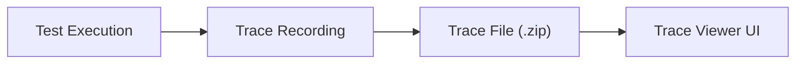
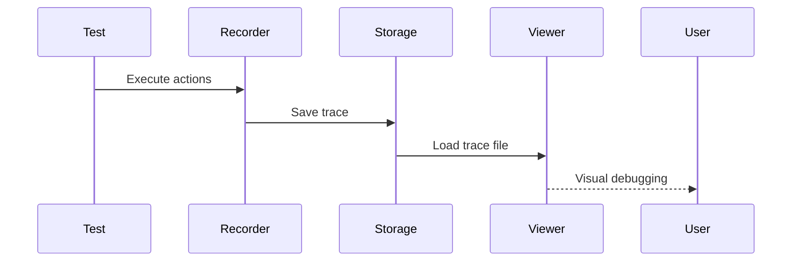
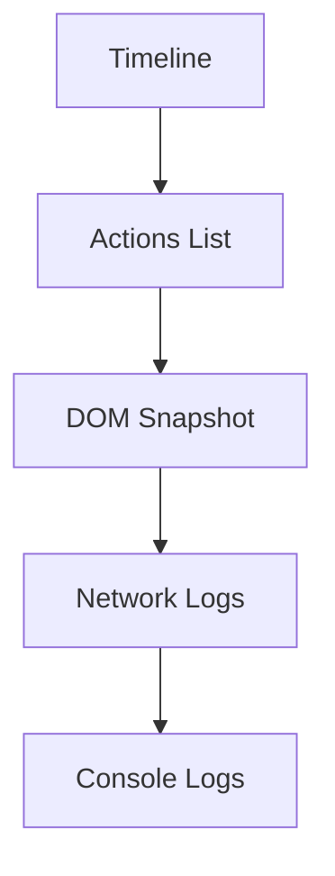

# 🔍 Trace Viewer (Playwright)

---

# 1. WHAT

👉 **Trace Viewer = A debugging tool that records and visualizes everything that happened during test execution**

It captures:

* Actions (click, fill, navigation)
* Network requests
* DOM snapshots
* Screenshots (step-by-step)

---

# 2. WHY

Without Trace Viewer:

* Hard to debug failures ❌
* No visibility into execution ❌

With Trace Viewer:

* Step-by-step replay ✅
* Visual debugging ✅
* Faster issue identification ✅

---

# 3. WHEN

Use when:

* Tests are failing
* Debugging flaky tests
* CI failures analysis
* Understanding test flow

---

# 4. HOW (CORE IDEA)

👉 Playwright records execution into a **trace file**
👉 You open it using Trace Viewer UI

---

## 🔄 TRACE FLOW



---

# 5. REAL-LIFE ANALOGY 🎥

CCTV camera:

* Records everything
* You replay footage to find issues

👉 Trace Viewer = Test execution CCTV

---

# 6. ENGINEERING VIEW

### Recording Layer

Captures:

* Actions
* Network
* Snapshots

### Storage Layer

Stores `.zip` trace file

### Visualization Layer

Interactive UI for debugging

---

## 🧠 INTERNAL FLOW



---

# 7. CONFIGURATION

---

## 🔧 Enable Trace

```ts
import { defineConfig } from '@playwright/test';

export default defineConfig({
  use: {
    trace: 'on'
  }
});
```

---

## 🔥 Recommended (Best Practice)

```ts
trace: 'on-first-retry'
```

👉 Records only when test fails

---

## 🎯 Other Options

```ts
trace: 'on'          // always
trace: 'retain-on-failure'
trace: 'off'
```

---

# 8. HOW TO VIEW TRACE

---

## Step 1: Run Test

```bash
npx playwright test
```

---

## Step 2: Open Trace

```bash
npx playwright show-trace trace.zip
```

---

# 9. TRACE VIEWER COMPONENTS



---

👉 You can:

* Click each step
* See UI changes
* Inspect network calls

---

# 10. REAL-WORLD USE CASE

👉 Login test failing:

Without trace:

* Guessing ❌

With trace:

* See exact step failure ✅
* Identify locator issue ✅

---

# 11. COMMON MISTAKES

❌ Always keeping trace ON (slow)
❌ Not using in CI
❌ Ignoring trace in flaky tests
❌ Not downloading trace artifacts

---

# 12. DEEP CONCEPTS

### Step Replay

Each action is recorded and replayable

### DOM Snapshot

State of UI at each step

### Time Travel Debugging

Move forward/backward in execution

---

# 13. MCQs

1. Trace Viewer is used for:
   A. Writing tests
   B. Debugging tests
   C. UI rendering
   D. Deployment

2. Trace file format:
   A. .json
   B. .zip
   C. .txt
   D. .xml

---

# 14. ANSWERS

1 → B
2 → B

---

# 15. PRACTICAL ASSIGNMENTS

* Enable trace recording
* Run failing test
* Open trace viewer
* Identify failure step

---

# 16. MINI PROJECT

👉 Debug E-commerce flow:

* Login failure
* Cart issue
* Checkout error

Use Trace Viewer to analyze

---

# 17. INTERVIEW NOTES

* Trace Viewer = debugging tool
* Records full execution
* Helps analyze failures
* Essential for CI debugging

---

# 18. SUMMARY

* Trace = execution recording
* Viewer = debugging UI
* Best used on failures
* Powerful for root cause analysis

---
