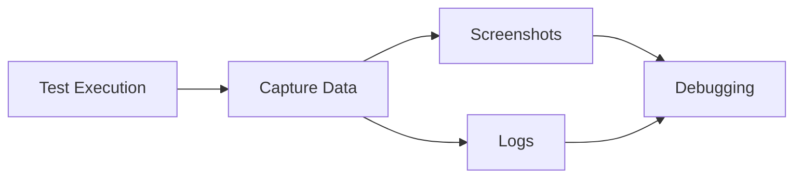
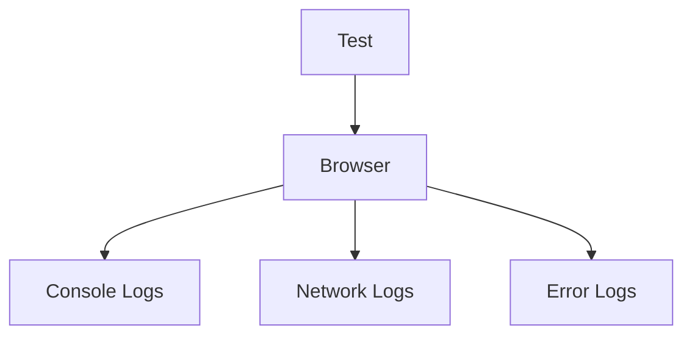

# 📸 Screenshots & Logs (Playwright)

---

# 1. WHAT

👉 **Screenshots** = Capturing UI state during test execution
👉 **Logs** = Recording execution details (console, network, steps)

---

# 2. WHY

Without screenshots & logs:

* No visibility into failures ❌
* Hard debugging ❌

With them:

* Visual proof of failure ✅
* Execution tracking ✅
* Faster debugging ✅

---

# 3. WHEN

Use when:

* Test fails
* Debugging issues
* CI pipeline analysis
* Monitoring flaky tests

---

# 4. HOW (CORE IDEA)

👉 During test execution:

* Capture screenshots at key steps
* Record logs (console, network, errors)

---

## 🔄 DEBUGGING FLOW



---

# 5. REAL-LIFE ANALOGY 📷

Crime investigation:

* Screenshot = Photo evidence
* Logs = Witness statements

👉 Together → full story

---

# 6. ENGINEERING VIEW

### Screenshots

* UI state capture
* Step-level or failure-level

### Logs

* Console logs
* Network logs
* Errors

---

# 7. SCREENSHOTS

---

## 📸 Manual Screenshot

```ts
await page.screenshot({ path: 'screenshot.png' });
```

---

## 📸 Full Page Screenshot

```ts
await page.screenshot({
  path: 'full.png',
  fullPage: true
});
```

---

## 📸 Screenshot on Failure (Auto)

```ts
use: {
  screenshot: 'only-on-failure'
}
```

---

## 📸 Always Capture

```ts
screenshot: 'on'
```

---

# 8. LOGS

---

## 📝 Console Logs

```ts
page.on('console', msg => {
  console.log(msg.text());
});
```

---

## 🌐 Network Logs

```ts
page.on('request', request => {
  console.log(request.url());
});
```

---

## ❌ Error Logs

```ts
page.on('pageerror', error => {
  console.log(error.message);
});
```

---

# 9. LOGGING FLOW



---

# 10. AUTOMATIC DEBUGGING (BEST PRACTICE)

```ts
export default defineConfig({
  use: {
    screenshot: 'only-on-failure',
    video: 'retain-on-failure',
    trace: 'on-first-retry'
  }
});
```

---

# 11. REAL-WORLD USE CASE

👉 Login failure:

* Screenshot → shows UI state
* Logs → show API failure

👉 Combined → root cause found

---

# 12. COMMON MISTAKES

❌ Capturing screenshots everywhere (slow)
❌ Ignoring logs
❌ Not storing artifacts in CI
❌ Overloading logs

---

# 13. DEEP CONCEPTS

### Observability in Testing

* Screenshots + Logs = visibility

### Failure Analysis

* Combine visual + technical data

### CI Artifacts

* Store logs/screenshots for later

---

# 14. MCQs

1. Screenshots are used for:
   A. UI capture
   B. API calls
   C. Logs
   D. Config

2. Logs help in:
   A. Styling
   B. Debugging
   C. UI rendering
   D. Deployment

---

# 15. ANSWERS

1 → A
2 → B

---

# 16. PRACTICAL ASSIGNMENTS

* Capture screenshot on failure
* Log network requests
* Log console errors

---

# 17. MINI PROJECT

👉 Debug failing checkout:

* Capture screenshot
* Capture logs
* Identify issue

---

# 18. INTERVIEW NOTES

* Screenshots = visual debugging
* Logs = execution insight
* Both = debugging essentials

---

# 19. SUMMARY

* Screenshots show UI
* Logs show behavior
* Combined = complete debugging

---
