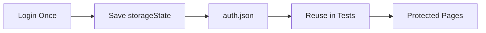
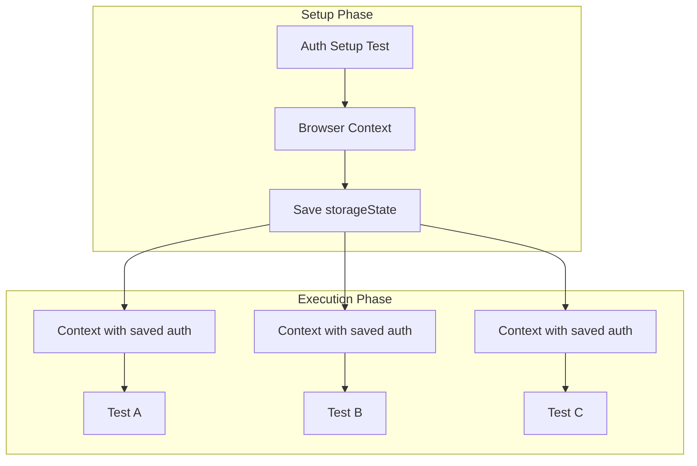
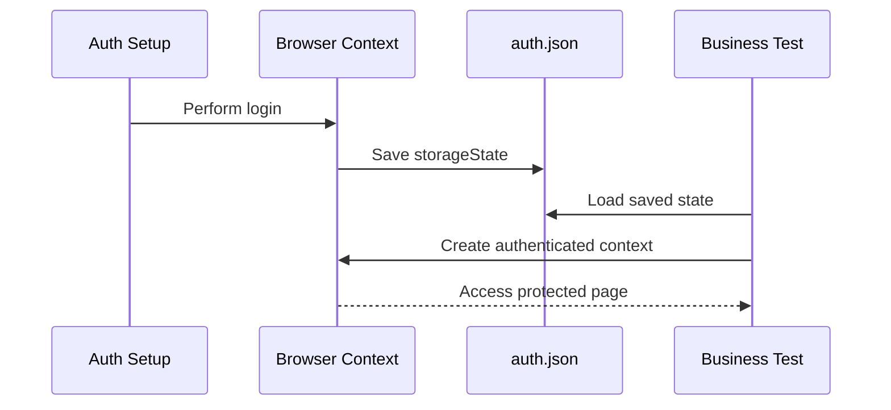
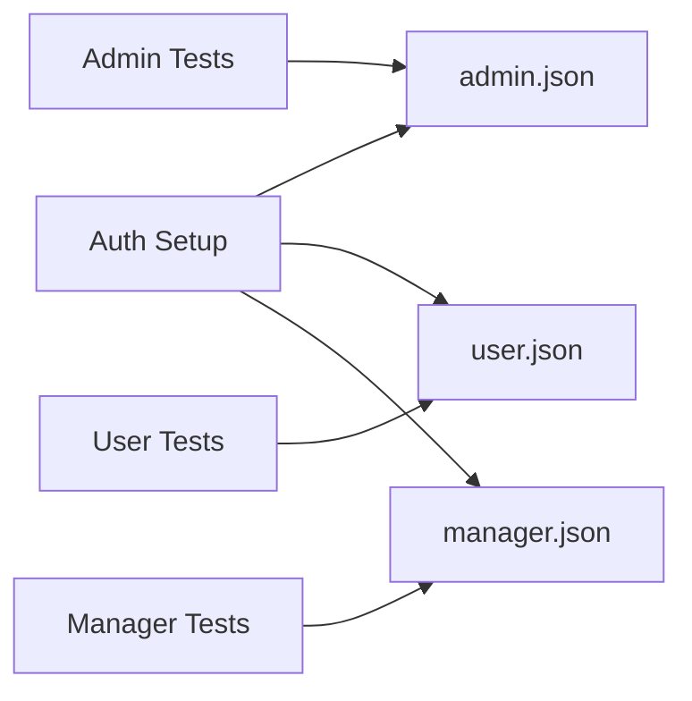
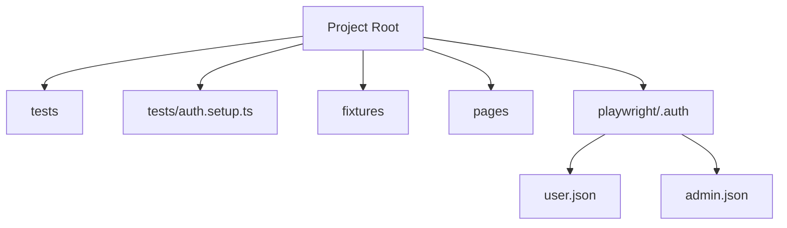

# 🔐 Authentication Handling (Session Reuse) — Playwright

---

# 1. WHAT

👉 **Authentication Handling** means managing login state in automation so tests can access protected pages without repeating login steps every time.

👉 **Session Reuse** means saving an authenticated session once and reusing it across multiple tests.

In Playwright, this is commonly done using:

* `storageState`
* setup/auth file
* reusable authenticated context

---

# 2. WHY

Without session reuse:

* Every test performs login again ❌
* Test suite becomes slow ❌
* Duplicate code increases ❌
* Login-dependent flakiness increases ❌

With session reuse:

* Faster execution ✅
* Cleaner tests ✅
* Better parallel execution ✅
* Reusable authenticated state ✅

---

# 3. WHEN

Use session reuse when:

* Application requires login before most workflows
* Same role is reused across many tests
* Running a large suite in CI/CD
* Login flow is expensive or multi-step
* MFA or external auth makes repeated login difficult

Do **not** blindly reuse one session for all situations when:

* Tests modify shared user data heavily
* Role-based scenarios require different users
* Session freshness is part of what you are testing
* You specifically need to validate login flow itself

---

# 4. HOW

Core idea:

1. Log in once
2. Save authenticated browser state
3. Reuse that state in future tests

Playwright stores session-related data such as:

* cookies
* local storage
* session-related browser state supported by `storageState`

---

## 🔄 High-Level Flow



---

# 5. REAL-LIFE ANALOGY

Think of an office building.

Without session reuse:

* Every time you move to another room, security asks you to sign in again

With session reuse:

* You receive an access badge once
* You use the same badge to enter other allowed areas

👉 `storageState` is like that saved access badge.

---

# 6. ENGINEERING VIEW

Authentication reuse is really about:

### A. State Persistence

Saving the authenticated browser state after successful login.

### B. Context Rehydration

Creating a new browser context using previously saved state.

### C. Isolation + Speed Balance

Reusing auth without sharing unstable runtime state between tests.

### D. Test Architecture Separation

* Login setup code in auth/setup file
* Business tests focus on workflows
* Config decides which projects use saved state

---

# 7. CORE PLAYWRIGHT CONCEPT: `storageState`

`storageState` is Playwright’s mechanism for saving and loading browser authentication state.

It can be:

* saved after login
* loaded before a test starts
* shared across projects or specific test groups

---

## Example: Save State

```ts
await page.context().storageState({ path: 'playwright/.auth/user.json' });
```

---

## Example: Reuse State

```ts
use: {
  storageState: 'playwright/.auth/user.json'
}
```

---

# 8. SESSION REUSE ARCHITECTURE



👉 Important:

* tests reuse saved auth state
* each test can still have its **own browser context**
* reused auth does **not** mean unsafe shared browser runtime

---

# 9. BASIC IMPLEMENTATION

## Step 1: Create Auth Setup File

Example: `tests/auth.setup.ts`

```ts
import { test as setup, expect } from '@playwright/test';

const authFile = 'playwright/.auth/user.json';

setup('authenticate', async ({ page }) => {
  await page.goto('https://example.com/login');

  await page.fill('#email', 'testuser@example.com');
  await page.fill('#password', 'password123');
  await page.click('#login');

  await expect(page).toHaveURL(/dashboard/);

  await page.context().storageState({ path: authFile });
});
```

---

## Step 2: Configure Playwright

Example: `playwright.config.ts`

```ts
import { defineConfig } from '@playwright/test';

export default defineConfig({
  testDir: './tests',
  projects: [
    {
      name: 'setup',
      testMatch: /.*\.setup\.ts/
    },
    {
      name: 'chromium',
      use: {
        browserName: 'chromium',
        storageState: 'playwright/.auth/user.json'
      },
      dependencies: ['setup']
    }
  ]
});
```

---

## Step 3: Write Normal Tests Without Login

```ts
import { test, expect } from '@playwright/test';

test('user can open dashboard', async ({ page }) => {
  await page.goto('https://example.com/dashboard');
  await expect(page.locator('h1')).toHaveText('Dashboard');
});
```

👉 No repeated login code needed.

---

# 10. EXECUTION FLOW



---

# 11. PROJECT-LEVEL CONFIGURATION

This is the most common enterprise pattern.

```ts
import { defineConfig, devices } from '@playwright/test';

export default defineConfig({
  testDir: './tests',
  use: {
    baseURL: 'https://example.com',
    trace: 'on-first-retry',
    screenshot: 'only-on-failure'
  },
  projects: [
    {
      name: 'setup',
      testMatch: /.*\.setup\.ts/
    },
    {
      name: 'admin-chromium',
      use: {
        ...devices['Desktop Chrome'],
        storageState: 'playwright/.auth/admin.json'
      },
      dependencies: ['setup']
    },
    {
      name: 'user-chromium',
      use: {
        ...devices['Desktop Chrome'],
        storageState: 'playwright/.auth/user.json'
      },
      dependencies: ['setup']
    }
  ]
});
```

---

# 12. ROLE-BASED SESSION REUSE

In real systems, one session is often not enough.

You may need:

* admin session
* normal user session
* manager session
* read-only session

---

## Role-Based Visual



---

# 13. USING FIXTURES WITH SESSION REUSE

Session reuse becomes cleaner when combined with fixtures.

Example:

```ts
import { test as base } from '@playwright/test';

export const test = base.extend({
  authenticatedPage: async ({ browser }, use) => {
    const context = await browser.newContext({
      storageState: 'playwright/.auth/user.json'
    });

    const page = await context.newPage();
    await use(page);
    await context.close();
  }
});
```

Usage:

```ts
import { test, expect } from './fixtures/auth.fixture';

test('profile page loads', async ({ authenticatedPage }) => {
  await authenticatedPage.goto('https://example.com/profile');
  await expect(authenticatedPage.locator('h1')).toHaveText('Profile');
});
```

---

# 14. SESSION REUSE vs LOGIN EVERY TEST

## Without Reuse

```ts
test('checkout flow', async ({ page }) => {
  await page.goto('/login');
  await page.fill('#email', 'user@test.com');
  await page.fill('#password', 'pass');
  await page.click('#login');
  await page.goto('/checkout');
});
```

## With Reuse

```ts
test('checkout flow', async ({ page }) => {
  await page.goto('/checkout');
});
```

👉 Cleaner
👉 Faster
👉 Easier to maintain

---

# 15. REAL-WORLD USE CASE

## E-commerce Application

Most tests require authenticated users:

* open dashboard
* view orders
* add address
* checkout
* update profile

Bad design:

* login steps repeated in every test

Better design:

* save user session once
* reuse it in all user-flow tests
* keep login flow testing separate

---

# 16. COMMON MISTAKES

### ❌ Mistake 1: Using one shared runtime browser for all tests

This breaks isolation.

### ❌ Mistake 2: Saving expired session state

Then tests fail unexpectedly.

### ❌ Mistake 3: Mixing login test with business tests

Keep auth setup separate.

### ❌ Mistake 4: Reusing same user where data collisions happen

Parallel tests may interfere.

### ❌ Mistake 5: Committing auth files with real secrets

Very risky.

### ❌ Mistake 6: Assuming session reuse replaces login testing

It does not. Login must still be tested separately.

---

# 17. DEEP CONCEPTS

## A. Authentication vs Authorization

* **Authentication** = Who are you?
* **Authorization** = What can you access?

A saved session proves authentication, but your tests may still need to verify authorization.

---

## B. Reuse Does Not Remove Isolation

Important engineering point:

* same saved auth file can be loaded into multiple fresh contexts
* contexts remain isolated
* cookies/state are initialized from file, not live-shared in memory

---

## C. Session Freshness

Sessions may expire due to:

* token timeout
* cookie expiration
* server invalidation
* environment reset

This means auth setup may need to run before the suite or per pipeline.

---

## D. Parallel Execution Impact

Session reuse helps parallel execution because:

* login bottleneck is removed
* tests start authenticated immediately

But parallel safety depends on data strategy:

* use unique test data
* avoid same mutable records
* use multiple accounts if needed

---

# 18. BEST PRACTICES

* Save auth state in a dedicated `.auth` folder
* Add auth files to `.gitignore`
* Keep login setup separate from business tests
* Use separate auth files for different user roles
* Refresh auth in CI when needed
* Still maintain dedicated login tests
* Combine session reuse with fixtures and POM

---

## Example `.gitignore`

```gitignore
playwright/.auth/
```

---

# 19. FOLDER STRUCTURE



---

# 20. MCQs

### 1. What is the main purpose of session reuse?

A. Increase test size
B. Avoid repeated login
C. Replace assertions
D. Disable authentication

### 2. Which Playwright feature is commonly used for session reuse?

A. screenshot
B. trace
C. storageState
D. locator

### 3. Reusing auth state means:

A. All tests share same live browser instance
B. Tests can start with saved authenticated state
C. Login is never tested again
D. No browser context is needed

### 4. Which is the best practice?

A. Commit auth files to GitHub
B. Put login code in every test
C. Use separate auth setup file
D. Share one mutable user across all destructive tests

### 5. Session reuse is most useful when:

A. Testing CSS only
B. Most tests require authenticated access
C. No login exists
D. No browser is used

---

# 21. ANSWERS

1 → B
2 → C
3 → B
4 → C
5 → B

---

# 22. SUBJECTIVE QUESTIONS

1. Explain authentication handling in Playwright.
2. What is session reuse and why is it useful?
3. How does `storageState` work?
4. Why should auth setup be separated from business tests?
5. What risks exist when reusing the same authenticated user in parallel tests?
6. Explain the difference between session reuse and test isolation.
7. How would you handle multiple roles such as admin and normal user?

---

# 23. PRACTICAL ASSIGNMENTS

## Task 1

Create an auth setup test that logs in and saves `storageState`.

## Task 2

Configure a Playwright project to use saved auth state.

## Task 3

Create one normal user auth file and one admin auth file.

## Task 4

Write two tests that access protected pages without performing login.

## Task 5

Create a reusable fixture called `authenticatedPage`.

---

# 24. MINI PROJECT

## Build: Authenticated E-commerce Automation

### Scope

* Setup auth for normal user
* Setup auth for admin
* Reuse sessions in protected flows

### User flows

* Open profile
* View orders
* Add item to cart
* Checkout

### Admin flows

* Open dashboard
* Manage products
* View reports

### Engineering goals

* no repeated login code
* role-based session reuse
* isolated test contexts
* CI-ready authentication design

---

# 25. INTERVIEW NOTES

* Session reuse in Playwright is typically done with `storageState`
* Save state after login, then load it in later tests
* Reuse improves speed and reduces duplication
* Keep auth setup separate from business flows
* Reused auth state does not mean shared unsafe runtime state
* For parallel execution, data isolation still matters
* Multiple user roles should use separate saved state files

---

# 26. SUMMARY

* Authentication handling is about managing login state correctly
* Session reuse avoids repeated login in every test
* Playwright uses `storageState` for saving and loading auth state
* Best practice is to log in once in setup, save auth, and reuse it in tests
* Keep isolation, role separation, and session freshness in mind
* This is a core enterprise-grade Playwright pattern

---
