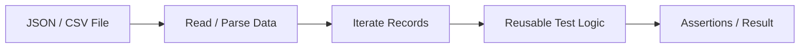
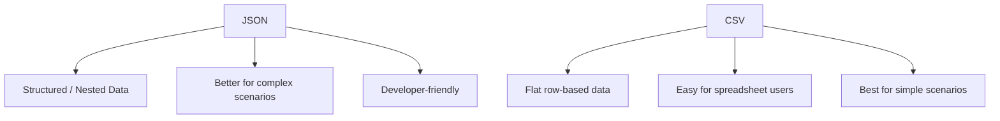
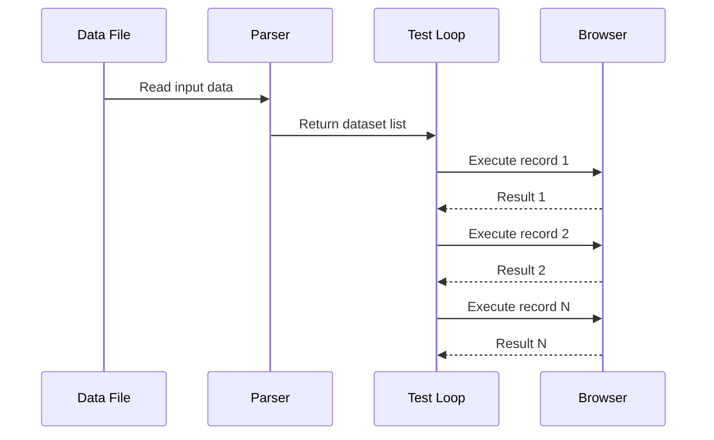
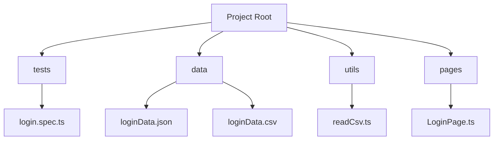

# 📊 Data-Driven Testing (JSON / CSV) — Playwright

---

# 1. WHAT

👉 **Data-Driven Testing** means running the same test logic with different sets of input data.

Instead of writing separate test cases manually, we:

* keep test logic reusable
* store input data outside the test
* feed multiple records into the same test flow

Common external data sources:

* JSON
* CSV

---

# 2. WHY

Without data-driven testing:

* repeated test code increases ❌
* maintenance becomes hard ❌
* adding new test scenarios takes longer ❌

With data-driven testing:

* same test can run with many datasets ✅
* coverage increases quickly ✅
* test logic stays clean ✅
* business scenarios become easier to manage ✅

---

# 3. WHEN

Use data-driven testing when:

* same workflow must be validated with many inputs
* form validation needs multiple datasets
* login, signup, checkout, search, filters, and role testing require variations
* expected outputs differ based on input combinations
* business team provides scenario data separately

Avoid blindly using it when:

* every test has very different flow logic
* test readability becomes worse than normal explicit tests
* data combinations become unrealistic or unmaintainable

---

# 4. HOW

Core idea:

1. store test data externally
2. read the data in the test
3. loop through each dataset
4. run the same workflow with different values

---

## 🔄 High-Level Flow



---

# 5. REAL-LIFE ANALOGY

Think of a school exam result sheet.

The checking rule is the same:

* verify student name
* verify marks
* verify pass/fail condition

But student data changes for each row.

👉 The checking process remains same
👉 Only input rows change

That is exactly what data-driven testing does.

---

# 6. ENGINEERING VIEW

Data-driven testing is based on these ideas:

### A. Separation of Logic and Data

* test logic stays in code
* input values stay in external files

### B. Reusability

* same workflow reused for multiple scenarios

### C. Scalability

* adding a new scenario often means only adding a new row/object

### D. Maintainability

* business data updates do not require rewriting test logic

---

# 7. JSON-BASED DATA-DRIVEN TESTING

JSON is best when:

* nested data is needed
* objects have multiple fields
* expected values vary by scenario
* role-based structured data is required

---

## Example JSON File

File: `data/loginData.json`

```json
[
  {
    "testName": "valid admin login",
    "username": "admin@example.com",
    "password": "Admin123",
    "expectedMessage": "Dashboard"
  },
  {
    "testName": "valid user login",
    "username": "user@example.com",
    "password": "User123",
    "expectedMessage": "Dashboard"
  },
  {
    "testName": "invalid password login",
    "username": "user@example.com",
    "password": "WrongPass",
    "expectedMessage": "Invalid credentials"
  }
]
```

---

## Example Playwright Test Using JSON

```ts
import { test, expect } from '@playwright/test';
import loginData from '../data/loginData.json';

for (const data of loginData) {
  test(`login scenario - ${data.testName}`, async ({ page }) => {
    await page.goto('https://example.com/login');

    await page.fill('#username', data.username);
    await page.fill('#password', data.password);
    await page.click('#loginBtn');

    await expect(page.locator('body')).toContainText(data.expectedMessage);
  });
}
```

👉 Here:

* same workflow reused
* only dataset changes

---

# 8. CSV-BASED DATA-DRIVEN TESTING

CSV is best when:

* data is flat/tabular
* business users prefer spreadsheet-style input
* scenarios are simple rows
* login, search, validation, pricing, filters are tested

---

## Example CSV File

File: `data/loginData.csv`

```csv
testName,username,password,expectedMessage
valid admin login,admin@example.com,Admin123,Dashboard
valid user login,user@example.com,User123,Dashboard
invalid password login,user@example.com,WrongPass,Invalid credentials
```

---

## Example CSV Parsing Approach

Playwright itself does not parse CSV automatically, so we usually use a parser library like `csv-parse` or simple Node parsing logic.

Example helper:

```ts
import fs from 'fs';

export function readCsv(filePath: string) {
  const content = fs.readFileSync(filePath, 'utf-8');
  const lines = content.trim().split('\n');
  const headers = lines[0].split(',');

  return lines.slice(1).map(line => {
    const values = line.split(',');
    const row: Record<string, string> = {};

    headers.forEach((header, index) => {
      row[header.trim()] = values[index].trim();
    });

    return row;
  });
}
```

---

## Example Playwright Test Using CSV

```ts
import { test, expect } from '@playwright/test';
import { readCsv } from '../utils/readCsv';

const loginData = readCsv('data/loginData.csv');

for (const data of loginData) {
  test(`login scenario - ${data.testName}`, async ({ page }) => {
    await page.goto('https://example.com/login');

    await page.fill('#username', data.username);
    await page.fill('#password', data.password);
    await page.click('#loginBtn');

    await expect(page.locator('body')).toContainText(data.expectedMessage);
  });
}
```

---

# 9. JSON vs CSV



---

## Comparison Table

| Aspect               | JSON          | CSV                 |
| -------------------- | ------------- | ------------------- |
| Structure            | Hierarchical  | Flat                |
| Nested fields        | Easy          | Difficult           |
| Human editing        | Good          | Very easy           |
| Spreadsheet friendly | Medium        | High                |
| Complex scenarios    | Better        | Limited             |
| Parsing simplicity   | Easy in JS/TS | Needs parsing logic |

---

# 10. DATA-DRIVEN EXECUTION FLOW



---

# 11. REAL-WORLD USE CASES

## A. Login Testing

Validate:

* valid users
* invalid passwords
* empty username
* locked account

## B. Signup Forms

Validate:

* required fields
* multiple email formats
* phone validation
* password strength

## C. Search Testing

Validate:

* exact match
* partial match
* special characters
* empty input

## D. Checkout Testing

Validate:

* multiple addresses
* payment methods
* discount combinations
* invalid coupon scenarios

---

# 12. BEST PRACTICE ARCHITECTURE

A strong reusable structure looks like this:



---

# 13. USING POM WITH DATA-DRIVEN TESTING

This is the preferred pattern.

## Login Page Example

```ts
import { Page, Locator } from '@playwright/test';

export class LoginPage {
  readonly page: Page;
  readonly username: Locator;
  readonly password: Locator;
  readonly loginButton: Locator;

  constructor(page: Page) {
    this.page = page;
    this.username = page.locator('#username');
    this.password = page.locator('#password');
    this.loginButton = page.locator('#loginBtn');
  }

  async goto() {
    await this.page.goto('https://example.com/login');
  }

  async login(username: string, password: string) {
    await this.username.fill(username);
    await this.password.fill(password);
    await this.loginButton.click();
  }
}
```

---

## POM + JSON Test Example

```ts
import { test, expect } from '@playwright/test';
import { LoginPage } from '../pages/LoginPage';
import loginData from '../data/loginData.json';

for (const data of loginData) {
  test(`login with dataset - ${data.testName}`, async ({ page }) => {
    const loginPage = new LoginPage(page);

    await loginPage.goto();
    await loginPage.login(data.username, data.password);

    await expect(page.locator('body')).toContainText(data.expectedMessage);
  });
}
```

👉 This keeps:

* test data external
* locators inside POM
* test logic readable

---

# 14. ADVANTAGES

* reduces duplicate code
* makes scenario expansion easier
* separates business data from automation flow
* improves maintainability
* works very well with POM and fixtures
* helpful for regression suites

---

# 15. DISADVANTAGES

* poor dataset design can create confusing tests
* debugging may be harder if test names are weak
* CSV parsing can become fragile for complex data
* too many combinations can create heavy execution time
* not every scenario should be parameterized

---

# 16. WHEN TO CHOOSE JSON vs CSV

Choose **JSON** when:

* you need nested objects
* each scenario has multiple related fields
* role-based, structured, or expected output objects are needed

Choose **CSV** when:

* data is row-based
* business or QA team manages data in spreadsheets
* the scenario is simple and flat

---

# 17. COMMON MISTAKES

### ❌ Mistake 1: Putting too much logic inside data file

Data should store values, not automation logic.

### ❌ Mistake 2: Weak test titles

If all tests have same name, debugging becomes painful.

### ❌ Mistake 3: Using CSV for deeply nested scenarios

CSV becomes messy for complex structures.

### ❌ Mistake 4: Mixing selectors with parsing logic

Keep parser, POM, and test logic separate.

### ❌ Mistake 5: Using invalid or unrealistic datasets

Bad data creates misleading failures.

### ❌ Mistake 6: Creating too many combinations without purpose

This increases runtime and maintenance cost.

---

# 18. DEEP CONCEPTS

## A. Parameterization vs Data-Driven Testing

* **Parameterization** = passing values directly into the test
* **Data-driven testing** = reading multiple records from external source

Data-driven is broader because it externalizes the dataset.

---

## B. Test Data Strategy

A good data strategy answers:

* who owns the test data?
* where is it stored?
* how often does it change?
* is the data reusable across environments?
* does it contain secrets?

---

## C. Positive vs Negative Data Sets

You should usually separate:

* valid data
* invalid data
* boundary cases

This improves clarity and avoids mixed-purpose files.

---

## D. Data Volume Balance

Too little data:

* weak coverage

Too much data:

* long execution time
* maintenance burden

The goal is meaningful scenario coverage, not maximum rows.

---

# 19. SAMPLE ADVANCED JSON STRUCTURE

```json
[
  {
    "testName": "admin login",
    "credentials": {
      "username": "admin@example.com",
      "password": "Admin123"
    },
    "expected": {
      "message": "Dashboard",
      "role": "admin"
    }
  },
  {
    "testName": "locked account login",
    "credentials": {
      "username": "locked@example.com",
      "password": "User123"
    },
    "expected": {
      "message": "Account locked",
      "role": "none"
    }
  }
]
```

This is one reason JSON is stronger for real-world complexity.

---

# 20. MCQs

### 1. Data-driven testing is mainly used to:

A. design UI
B. reuse same test logic with multiple datasets
C. remove assertions
D. replace locators

### 2. Which format is better for nested data?

A. CSV
B. JSON
C. TXT
D. PNG

### 3. CSV is most suitable for:

A. deep nested object scenarios
B. row-based simple datasets
C. DOM snapshots
D. screenshots

### 4. Best practice is:

A. keep test data external
B. hardcode all values in each test
C. mix parsing and locators together
D. avoid test names

### 5. Data-driven testing helps improve:

A. duplication
B. maintenance burden only
C. coverage and reusability
D. CSS rendering

---

# 21. ANSWERS

1 → B
2 → B
3 → B
4 → A
5 → C

---

# 22. SUBJECTIVE QUESTIONS

1. Explain data-driven testing in Playwright.
2. What is the difference between JSON-based and CSV-based testing?
3. When should you choose JSON over CSV?
4. How does data-driven testing improve maintainability?
5. Why is POM useful with data-driven testing?
6. What are common risks in poor test data design?
7. How would you organize test data for valid, invalid, and boundary scenarios?

---

# 23. PRACTICAL ASSIGNMENTS

## Task 1

Create a `loginData.json` file with:

* valid login
* invalid login
* empty password case

## Task 2

Write one Playwright test that loops through JSON data.

## Task 3

Create a `loginData.csv` file with the same scenarios.

## Task 4

Write a CSV parser helper and execute tests with CSV input.

## Task 5

Move login selectors into a `LoginPage` POM class and combine it with JSON data.

---

# 24. MINI PROJECT

## Build: Data-Driven Login & Signup Validation Suite

### Scope

* login validation with JSON
* signup validation with CSV
* success + failure scenarios

### Required design

* `data/` folder for datasets
* `pages/` folder for POM
* reusable parser utility for CSV
* meaningful test titles using dataset name

### Suggested flows

* login
* signup
* forgot password
* search validation

### Engineering goals

* no duplicate test logic
* easy scenario expansion
* readable reporting
* maintainable test structure

---

# 25. INTERVIEW NOTES

* Data-driven testing means same workflow runs with multiple datasets
* JSON and CSV are common external data sources
* JSON is better for structured/nested data
* CSV is better for flat spreadsheet-like data
* Combine data-driven testing with POM for strong architecture
* Keep data separate from logic
* Use descriptive test names so failures are easy to debug

---

# 26. SUMMARY

* Data-driven testing improves coverage, reusability, and maintainability
* JSON and CSV help externalize test input
* JSON works better for complex structured data
* CSV works better for flat row-based data
* Best practice is to combine external data + POM + clean test loop
* This is a very practical enterprise automation pattern

---
