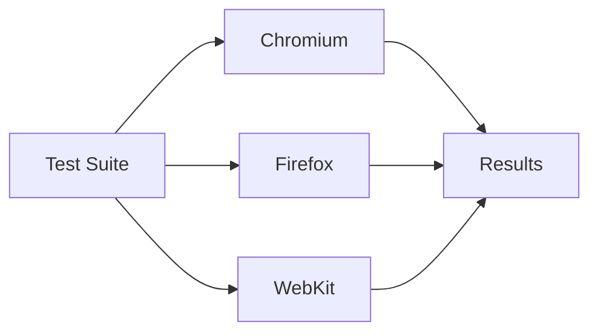
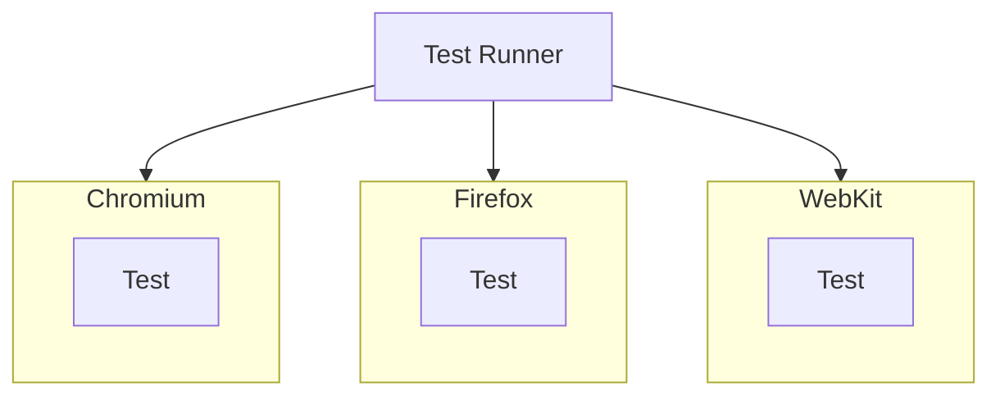
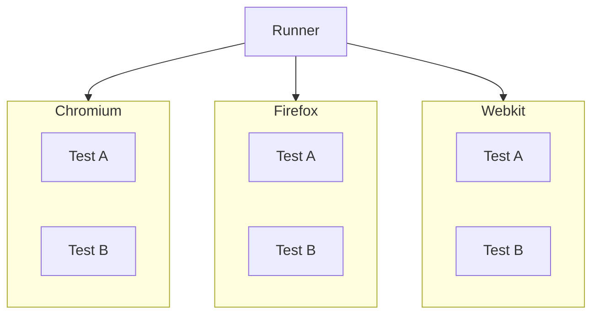
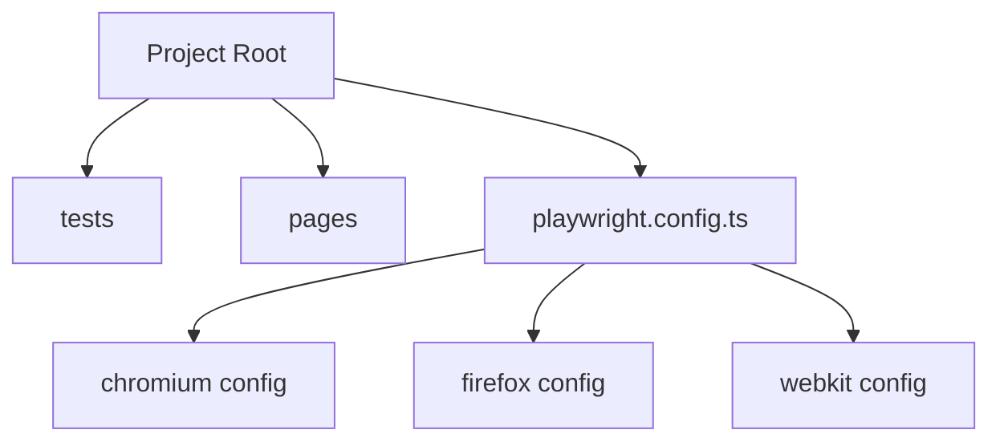

# 🌐 Cross-Browser Testing — Playwright

---

# 1. WHAT

👉 **Cross-Browser Testing** = Running the same tests across different browsers to ensure consistent behavior.

In Playwright, this means executing tests on:

* **Chromium** (Chrome/Edge)
* **Firefox**
* **WebKit** (Safari engine)

---

# 2. WHY

Without cross-browser testing:

* Works in one browser, fails in another ❌
* CSS/layout differences go unnoticed ❌
* Browser-specific bugs slip to production ❌

With cross-browser testing:

* Consistent UX across browsers ✅
* Early detection of browser-specific issues ✅
* Higher confidence before release ✅

---

# 3. WHEN

Use when:

* Application is user-facing (web app, e-commerce, SaaS)
* Target users use multiple browsers/devices
* UI/UX consistency is critical
* Regression suites before release
* CI/CD pipelines

Avoid overuse when:

* Internal tools with controlled browser usage
* Prototype-level testing

---

# 4. HOW (CORE IDEA)

👉 Define multiple **projects** in `playwright.config.ts`
👉 Each project = one browser configuration
👉 Playwright runs the same tests across all projects

---

## 🔄 High-Level Flow



---

# 5. REAL-LIFE ANALOGY 🚗

Car testing:

* Same car is tested on:

  * highways
  * city roads
  * rough terrain

👉 Same product, different environments

---

# 6. ENGINEERING VIEW

### A. Projects

Each browser is configured as a **project**.

### B. Isolation

Each browser run is independent.

### C. Parallelism

Browsers can run in parallel for speed.

### D. Capability Matrix

Different browsers represent different rendering engines.

---

# 7. BASIC CONFIGURATION

## playwright.config.ts

```ts
import { defineConfig } from '@playwright/test';

export default defineConfig({
  projects: [
    {
      name: 'chromium',
      use: { browserName: 'chromium' }
    },
    {
      name: 'firefox',
      use: { browserName: 'firefox' }
    },
    {
      name: 'webkit',
      use: { browserName: 'webkit' }
    }
  ]
});
```

👉 This automatically runs all tests in all browsers.

---

# 8. EXECUTION MODEL (REALISTIC)



---

# 9. PARALLEL CROSS-BROWSER EXECUTION



👉 Each browser can run tests in parallel using workers.

---

# 10. USING DEVICES (MOBILE + DESKTOP)

```ts
import { defineConfig, devices } from '@playwright/test';

export default defineConfig({
  projects: [
    {
      name: 'Desktop Chrome',
      use: { ...devices['Desktop Chrome'] }
    },
    {
      name: 'iPhone Safari',
      use: { ...devices['iPhone 13'] }
    }
  ]
});
```

👉 Now you're testing:

* Desktop Chrome
* Mobile Safari

---

# 11. SELECTIVE EXECUTION

Run only one browser:

```bash
npx playwright test --project=chromium
```

Run multiple:

```bash
npx playwright test --project=chromium --project=firefox
```

---

# 12. REAL-WORLD USE CASE

👉 E-commerce site:

* Product page works in Chrome
* Fails in Safari due to CSS issue

Cross-browser testing:

* Detects issue early
* Prevents production bug

---

# 13. COMMON ISSUES

* CSS rendering differences
* Flexbox/Grid inconsistencies
* Font rendering issues
* JavaScript engine differences
* Timing issues (async behavior)

---

# 14. COMMON MISTAKES

❌ Testing only Chromium
❌ Ignoring WebKit (Safari users)
❌ Not running in CI
❌ Hardcoding browser-specific logic
❌ Not handling responsive layouts

---

# 15. DEEP CONCEPTS

### A. Rendering Engines

* Chromium → Blink
* Firefox → Gecko
* WebKit → Safari engine

Different engines → different behavior

---

### B. Flaky Tests Across Browsers

A test passing in one browser and failing in another may indicate:

* timing issue
* locator instability
* CSS differences

---

### C. Browser Capability Differences

Not all APIs behave identically across browsers.

---

# 16. BEST PRACTICES

* Always include at least 2 browsers (Chromium + WebKit)
* Run cross-browser tests in CI
* Use responsive testing where needed
* Keep locators stable (avoid brittle selectors)
* Combine with screenshots & trace for debugging
* Avoid browser-specific hacks unless necessary

---

# 17. ADVANTAGES

* improves product quality
* catches browser-specific bugs
* increases confidence before release
* essential for production-grade testing

---

# 18. DISADVANTAGES

* increases execution time
* more resource usage
* requires better test stability
* debugging can take longer

---

# 19. FOLDER STRUCTURE IMPACT



---

# 20. MCQs

### 1. Cross-browser testing ensures:

A. UI design
B. Consistency across browsers
C. Faster API calls
D. Database optimization

### 2. Playwright supports:

A. Only Chrome
B. Only Firefox
C. Chromium, Firefox, WebKit
D. Only Safari

### 3. Projects in Playwright represent:

A. UI components
B. Test data
C. Browser configurations
D. Logs

---

# 21. ANSWERS

1 → B
2 → C
3 → C

---

# 22. SUBJECTIVE QUESTIONS

1. What is cross-browser testing and why is it important?
2. How does Playwright implement cross-browser testing?
3. What are common issues across browsers?
4. How would you optimize cross-browser execution in CI?
5. Explain browser engines and their impact.

---

# 23. PRACTICAL ASSIGNMENTS

* Configure 3 browsers in Playwright
* Run tests across all browsers
* Identify differences in UI behavior
* Debug a failure using screenshots/trace

---

# 24. MINI PROJECT

## Build: Cross-Browser E-commerce Validation

### Scope

* Product page validation
* Cart functionality
* Checkout flow

### Run across:

* Chromium
* Firefox
* WebKit

### Goal:

* Ensure consistent behavior across all browsers

---

# 25. INTERVIEW NOTES

* Cross-browser testing ensures compatibility
* Playwright uses projects for browser configs
* Supports Chromium, Firefox, WebKit
* Essential for UI reliability
* Combine with parallel execution for speed

---

# 26. SUMMARY

* Same test, multiple browsers
* Detect inconsistencies early
* Essential for production-ready applications
* Implemented using Playwright projects

---
