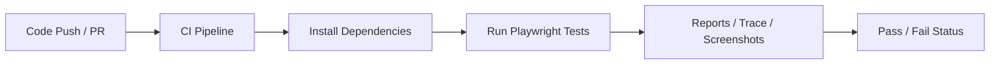
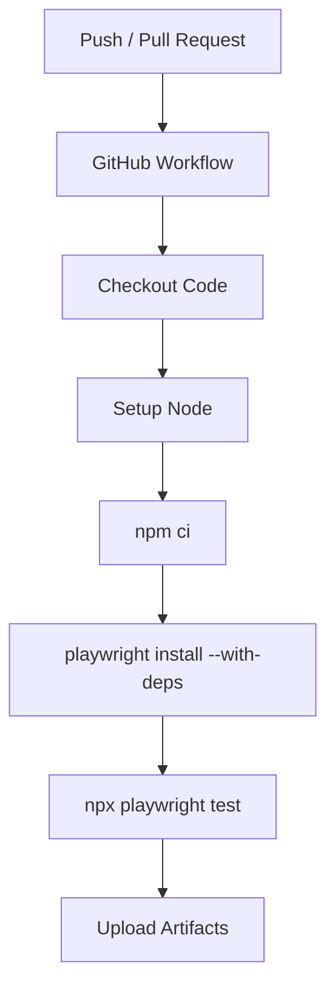
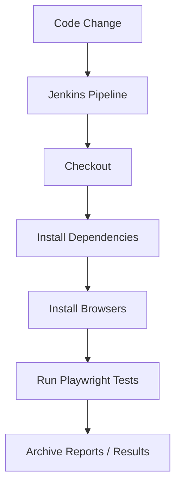
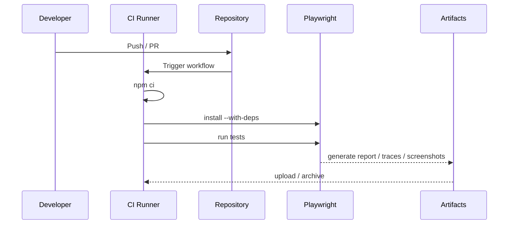

# 🚀 CI/CD Integration (GitHub Actions / Jenkins) — Playwright

---

# 1. WHAT

👉 **CI/CD integration** means connecting your Playwright test suite to an automated pipeline so tests run on code changes, pull requests, merges, or deployments.

In simple words:

* Developer pushes code
* CI system starts automatically
* Dependencies and browsers are installed
* Playwright tests run
* Reports, traces, screenshots, and logs are stored

Common CI tools:

* **GitHub Actions**
* **Jenkins**

---

# 2. WHY

Without CI/CD integration:

* testing depends on manual execution ❌
* regressions are found late ❌
* release confidence becomes low ❌
* team collaboration becomes slower ❌

With CI/CD:

* tests run automatically on every change ✅
* failures are caught early ✅
* reports and artifacts are visible centrally ✅
* release quality improves ✅

---

# 3. WHEN

Use CI/CD integration when:

* your app is under active development
* multiple developers are pushing code
* you want pull request validation
* regression testing is required before release
* you want test evidence stored automatically

---

# 4. HOW

Core idea:

1. code changes trigger pipeline
2. CI runner starts
3. dependencies are installed
4. Playwright browsers/deps are installed
5. tests run
6. artifacts are published

---

## 🔄 High-Level Flow



---

# 5. REAL-LIFE ANALOGY

Think of airport security.

Every passenger must pass through the same checks before boarding:

* identity check
* baggage scan
* safety verification

CI/CD works the same way for code:

* code commit enters pipeline
* automated checks run
* only verified code moves forward

---

# 6. ENGINEERING VIEW

CI/CD integration for Playwright has these layers:

### A. Trigger Layer

Starts on:

* push
* pull request
* scheduled run
* manual run

### B. Environment Layer

Creates a runner/server where tests execute.

### C. Execution Layer

Runs:

* `npm ci`
* `npx playwright install --with-deps`
* `npx playwright test`

### D. Artifact Layer

Stores:

* HTML reports
* traces
* screenshots
* test result files

---

# 7. PLAYWRIGHT CI BASICS

Playwright’s official CI guidance is straightforward:

1. Ensure the CI agent can run browsers.
2. Install project dependencies.
3. Install Playwright browsers and required OS dependencies.
4. Run the tests.

For Node.js projects, the typical commands are:

```bash
npm ci
npx playwright install --with-deps
npx playwright test
```

---

# 8. GITHUB ACTIONS — WHAT IT IS

**GitHub Actions** is GitHub’s built-in automation system for workflows. Workflow files are YAML files stored in `.github/workflows`, and they can run on events like pushes and pull requests. ([GitHub Docs][1])

---

# 9. GITHUB ACTIONS — BASIC PLAYWRIGHT WORKFLOW

File: `.github/workflows/playwright.yml`

```yaml
name: Playwright Tests

on:
  push:
    branches: [ main, master ]
  pull_request:
    branches: [ main, master ]

jobs:
  test:
    runs-on: ubuntu-latest

    steps:
      - name: Checkout repository
        uses: actions/checkout@v4

      - name: Setup Node.js
        uses: actions/setup-node@v4
        with:
          node-version: 20
          cache: npm

      - name: Install dependencies
        run: npm ci

      - name: Install Playwright browsers
        run: npx playwright install --with-deps

      - name: Run Playwright tests
        run: npx playwright test

      - name: Upload Playwright report
        if: always()
        uses: actions/upload-artifact@v4
        with:
          name: playwright-report
          path: playwright-report/

      - name: Upload test results
        if: always()
        uses: actions/upload-artifact@v4
        with:
          name: test-results
          path: test-results/
```

This follows the official workflow structure GitHub expects and the Playwright installation flow Playwright documents for CI. ([Playwright][2])

---

# 10. GITHUB ACTIONS FLOW



---

# 11. GITHUB ACTIONS — IMPORTANT POINTS

### Workflow File Location

Workflow YAML files must be stored in:

```text
.github/workflows/
```

### Triggers

Common triggers:

* `push`
* `pull_request`
* `workflow_dispatch`
* `schedule`

### Artifacts

Useful artifacts to upload:

* `playwright-report/`
* `test-results/`
* trace files
* screenshots
* videos

GitHub Actions supports these workflow concepts officially, and Playwright’s docs also emphasize reports and traces as key CI debugging outputs. ([Playwright][3])

---

# 12. GITHUB ACTIONS — PARALLEL / MATRIX EXECUTION

A strong CI pattern is to run multiple browsers using a matrix.

```yaml
name: Playwright Matrix Tests

on:
  pull_request:
    branches: [ main ]

jobs:
  test:
    runs-on: ubuntu-latest
    strategy:
      matrix:
        project: [chromium, firefox, webkit]

    steps:
      - uses: actions/checkout@v4

      - uses: actions/setup-node@v4
        with:
          node-version: 20
          cache: npm

      - run: npm ci
      - run: npx playwright install --with-deps
      - run: npx playwright test --project=${{ matrix.project }}

      - name: Upload report
        if: always()
        uses: actions/upload-artifact@v4
        with:
          name: playwright-report-${{ matrix.project }}
          path: playwright-report/
```

GitHub Actions supports matrix strategies and workflow expressions/contexts like `${{ matrix.project }}`. ([GitHub Docs][4])

---

# 13. JENKINS — WHAT IT IS

**Jenkins** is a CI/CD automation server widely used for build, test, and deployment pipelines. In Jenkins pipelines, you typically define stages such as checkout, install, test, and archive, and Jenkins can record and aggregate test results plus archive build artifacts. ([Jenkins][5])

---

# 14. BASIC JENKINS PIPELINE FOR PLAYWRIGHT

File: `Jenkinsfile`

```groovy
pipeline {
    agent any

    stages {
        stage('Checkout') {
            steps {
                checkout scm
            }
        }

        stage('Install Node Modules') {
            steps {
                sh 'npm ci'
            }
        }

        stage('Install Playwright Browsers') {
            steps {
                sh 'npx playwright install --with-deps'
            }
        }

        stage('Run Tests') {
            steps {
                sh 'npx playwright test'
            }
        }
    }

    post {
        always {
            archiveArtifacts artifacts: 'playwright-report/**/*', allowEmptyArchive: true
            archiveArtifacts artifacts: 'test-results/**/*', allowEmptyArchive: true
        }
        failure {
            echo 'Playwright tests failed'
        }
    }
}
```

This matches the same Playwright CI execution model: install dependencies, install browsers, run tests, then store artifacts. Jenkins artifact archiving is the natural equivalent of GitHub artifact upload. ([Playwright][2])

---

# 15. JENKINS FLOW



---

# 16. PLAYWRIGHT CONFIG FOR CI

A CI-friendly Playwright configuration usually includes:

* concise reporter in CI
* trace on first retry
* screenshot on failure
* video on failure
* retries in CI
* fewer workers in CI

Example:

```ts
import { defineConfig } from '@playwright/test';

export default defineConfig({
  retries: process.env.CI ? 2 : 0,
  workers: process.env.CI ? 2 : undefined,
  reporter: process.env.CI ? 'dot' : 'list',
  use: {
    trace: 'on-first-retry',
    screenshot: 'only-on-failure',
    video: 'retain-on-failure'
  }
});
```

Playwright explicitly documents CI-friendly reporters, and traces are strongly recommended for debugging failures in CI. ([Playwright][6])

---

# 17. END-TO-END CI EXECUTION MODEL



---

# 18. USING DOCKER IN CI

Playwright also documents a Docker-based approach for CI, especially on Linux, using Playwright’s Docker image that already contains browser system dependencies. This can make CI agents more predictable and reduce machine-level dependency issues. ([Playwright][2])

Example idea:

```yaml
container:
  image: mcr.microsoft.com/playwright:v1.55.0-noble
```

Use this when:

* CI agents vary a lot
* dependency issues happen often
* you want more reproducible test environments

---

# 19. REAL-WORLD USE CASE

## E-commerce Team Workflow

Every pull request should trigger:

* checkout
* dependency install
* browser install
* smoke tests
* artifact upload

Before release branch merge:

* full regression
* cross-browser execution
* traces on retry
* HTML report storage

This gives the team:

* fast PR feedback
* release confidence
* failure visibility

---

# 20. ADVANTAGES

* automated regression checks
* faster feedback to developers
* release confidence
* centralized reports and artifacts
* better team collaboration
* easier failure investigation

---

# 21. DISADVANTAGES

* longer pipeline time if poorly designed
* infrastructure cost
* flaky tests become more visible
* browser installation can slow pipelines if not optimized
* artifact storage can grow large

---

# 22. COMMON MISTAKES

### ❌ Mistake 1: Running tests without installing Playwright browsers

Tests fail because browsers or OS deps are missing.

### ❌ Mistake 2: Not storing artifacts

You lose traces, reports, screenshots, and debugging becomes harder.

### ❌ Mistake 3: Using too many workers in CI

This can overload smaller runners and make tests unstable.

### ❌ Mistake 4: No retries in CI

Transient failures become harder to diagnose.

### ❌ Mistake 5: Mixing local and CI assumptions

CI environments are usually cleaner and stricter than local machines.

### ❌ Mistake 6: Ignoring HTML reports and traces

These are some of the most useful debugging outputs Playwright provides in CI.

---

# 23. BEST PRACTICES

* use `npm ci` instead of `npm install` in CI
* run `npx playwright install --with-deps`
* keep CI reporter concise
* upload artifacts even when tests fail
* use `trace: 'on-first-retry'`
* use fewer workers in CI
* separate smoke tests and full regression
* run cross-browser jobs where needed
* use matrix strategy for browser coverage
* use Docker when runner consistency is a problem

These align closely with the official Playwright CI and reporting guidance. ([Playwright][2])

---

# 24. GITHUB ACTIONS vs JENKINS

| Aspect       | GitHub Actions                   | Jenkins                        |
| ------------ | -------------------------------- | ------------------------------ |
| Setup        | Easier in GitHub repos           | More infrastructure control    |
| Hosting      | GitHub-managed runners available | Self-managed or hosted         |
| Config style | YAML workflow files              | Jenkinsfile / pipeline         |
| Ecosystem    | Native GitHub integration        | Very flexible plugin ecosystem |
| Maintenance  | Lower                            | Higher                         |
| Best for     | GitHub-centric teams             | Custom enterprise pipelines    |

This comparison is an engineering judgment based on their normal usage patterns; exact fit depends on your team’s infrastructure and compliance needs.

---

# 25. MCQs

### 1. In Playwright CI, which command installs browsers and OS dependencies?

A. `npm ci`
B. `npx playwright install --with-deps`
C. `npx playwright show-report`
D. `node install`

### 2. GitHub Actions workflow files are stored in:

A. `src/workflows/`
B. `.ci/workflows/`
C. `.github/workflows/`
D. `tests/workflows/`

### 3. Which CI artifact is especially useful for debugging Playwright failures?

A. CSS file
B. Trace
C. README
D. package.json

### 4. Jenkins can help by:

A. archiving artifacts and test outputs
B. replacing browsers
C. removing dependencies
D. disabling test reports

### 5. A good Playwright CI setting is:

A. `trace: 'off'` always
B. `reporter: process.env.CI ? 'dot' : 'list'`
C. maximum workers always
D. no artifacts on failure

---

# 26. ANSWERS

1 → B
2 → C
3 → B
4 → A
5 → B

---

# 27. SUBJECTIVE QUESTIONS

1. Explain CI/CD integration for Playwright.
2. Why is `npx playwright install --with-deps` important in CI?
3. How do GitHub Actions and Jenkins differ for Playwright automation?
4. Why should traces and reports be uploaded as artifacts?
5. How would you optimize Playwright execution for CI stability?
6. What is the role of matrix execution in GitHub Actions?
7. When would Docker be useful for Playwright CI?

---

# 28. PRACTICAL ASSIGNMENTS

## Task 1

Create a GitHub Actions workflow that:

* runs on push and pull request
* installs dependencies
* installs browsers
* runs Playwright tests

## Task 2

Upload:

* `playwright-report/`
* `test-results/`

## Task 3

Add CI-friendly config:

* retries in CI
* trace on first retry
* screenshots on failure

## Task 4

Create a Jenkins pipeline that:

* checks out code
* runs Playwright tests
* archives reports

## Task 5

Add a matrix strategy in GitHub Actions for:

* chromium
* firefox
* webkit

---

# 29. MINI PROJECT

## Build: Enterprise Playwright CI Pipeline

### Scope

* GitHub Actions workflow
* Jenkins pipeline
* artifact upload
* cross-browser execution
* retry strategy
* CI-friendly Playwright config

### Required features

* run on pull request
* run smoke tests fast
* store traces and HTML report
* support browser matrix
* stable retry behavior
* publish test evidence

### Engineering goals

* fast developer feedback
* reliable regression execution
* easy debugging from artifacts
* scalable CI test architecture

---

# 30. INTERVIEW NOTES

* Playwright CI setup usually means:

  * `npm ci`
  * `npx playwright install --with-deps`
  * `npx playwright test`
* GitHub Actions workflows live in `.github/workflows`
* Jenkins pipelines can archive Playwright reports and test results
* Traces and HTML reports are critical debugging artifacts
* CI config should usually reduce workers and enable retries
* Matrix builds are useful for cross-browser execution
* Docker can improve CI reproducibility

---

# 31. SUMMARY

* CI/CD integration automates Playwright testing on code changes
* GitHub Actions and Jenkins both work well for Playwright
* Core CI flow is:

  * install dependencies
  * install browsers/deps
  * run tests
  * upload/archive artifacts
* Reports, traces, screenshots, and retries make CI debugging practical
* This is a core enterprise-ready automation capability

---

[1]: https://docs.github.com/actions/using-workflows/workflow-syntax-for-github-actions?utm_source=chatgpt.com "Workflow syntax for GitHub Actions"
[2]: https://playwright.dev/docs/ci?utm_source=chatgpt.com "Continuous Integration"
[3]: https://playwright.dev/docs/ci-intro?utm_source=chatgpt.com "Setting up CI"
[4]: https://docs.github.com/en/actions/reference/workflows-and-actions/contexts?utm_source=chatgpt.com "Contexts reference - GitHub Docs"
[5]: https://www.jenkins.io/doc/pipeline/tour/tests-and-artifacts/?utm_source=chatgpt.com "Recording tests and artifacts"
[6]: https://playwright.dev/docs/test-reporters?utm_source=chatgpt.com "Reporters"
